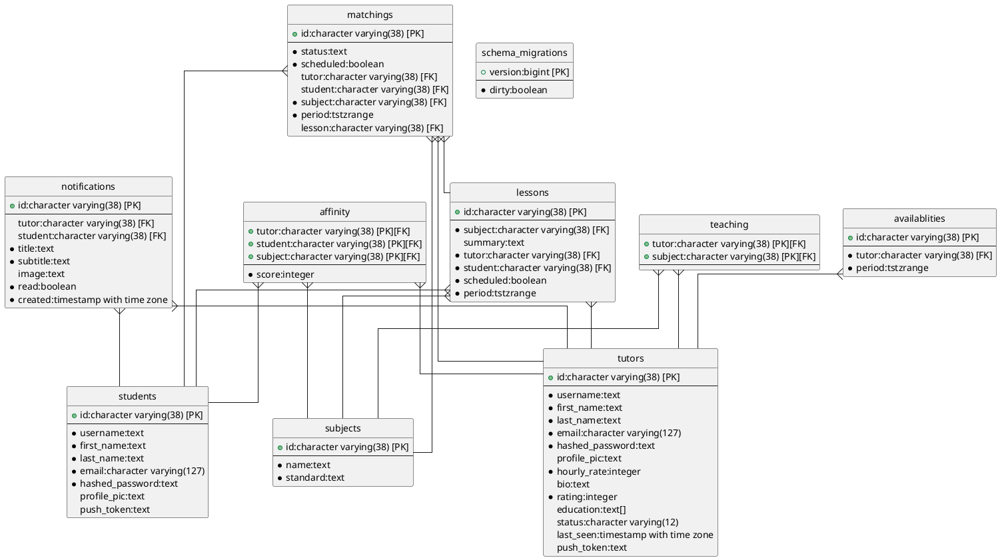

```plantuml
@startuml
hide circle
skinparam linetype ortho

entity "affinity" {
  + tutor:character varying(38) [PK][FK]
  + student:character varying(38) [PK][FK]
  + subject:character varying(38) [PK][FK]
  --
  *score:integer 
}

entity "availablities" {
  + id:character varying(38) [PK]
  --
  *tutor:character varying(38) [FK]
  *period:tstzrange 
}

entity "lessons" {
  + id:character varying(38) [PK]
  --
  *subject:character varying(38) [FK]
  summary:text 
  *tutor:character varying(38) [FK]
  *student:character varying(38) [FK]
  *scheduled:boolean 
  *period:tstzrange 
}

entity "matchings" {
  + id:character varying(38) [PK]
  --
  *status:text 
  *scheduled:boolean 
  tutor:character varying(38) [FK]
  student:character varying(38) [FK]
  *subject:character varying(38) [FK]
  *period:tstzrange 
  lesson:character varying(38) [FK]
}

entity "notifications" {
  + id:character varying(38) [PK]
  --
  tutor:character varying(38) [FK]
  student:character varying(38) [FK]
  *title:text 
  *subtitle:text 
  image:text 
  *read:boolean 
  *created:timestamp with time zone 
}

entity "schema_migrations" {
  + version:bigint [PK]
  --
  *dirty:boolean 
}

entity "students" {
  + id:character varying(38) [PK]
  --
  *username:text 
  *first_name:text 
  *last_name:text 
  *email:character varying(127) 
  *hashed_password:text 
  profile_pic:text 
  push_token:text 
}

entity "subjects" {
  + id:character varying(38) [PK]
  --
  *name:text 
  *standard:text 
}

entity "teaching" {
  + tutor:character varying(38) [PK][FK]
  + subject:character varying(38) [PK][FK]
  --
}

entity "tutors" {
  + id:character varying(38) [PK]
  --
  *username:text 
  *first_name:text 
  *last_name:text 
  *email:character varying(127) 
  *hashed_password:text 
  profile_pic:text 
  *hourly_rate:integer 
  bio:text 
  *rating:integer 
  education:text[] 
  status:character varying(12) 
  last_seen:timestamp with time zone 
  push_token:text 
}

 affinity }-- students

 affinity }-- subjects

 affinity }-- tutors

 availablities }-- tutors

 lessons }-- students

 lessons }-- subjects

 lessons }-- tutors

 matchings }-- lessons

 matchings }-- students

 matchings }-- subjects

 matchings }-- tutors

 notifications }-- students

 notifications }-- tutors

 teaching }-- subjects

 teaching }-- tutors
@enduml
```
